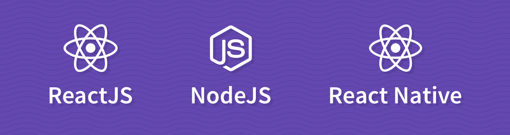

# Sobre os bootscamps da Rocketseat
> Treinamentos completos do zero ao profissional com metodologia baseada na prática de desafios!
> 

Não, não é aqui que você vai encontrar uma lista enorme de cursos.

Nós nos importamos *(e muito)* com o seu tempo. E para que você não precise gastar ele decidindo quais linguagens e tecnologias você vai escolher dentre uma lista quase infinita de possibilidades, nós fizemos isso para você.

Para chegar nessa stack, não nos baseamos apenas em critérios como produtividade, facilidade de evoluir e manter o código, curva de aprendizado e performance. Mas também em perguntas como:

- Onde essa tecnologia se aplica? 
- Qual o tamanho da comunidade? 
- Quem são as pessoas e empresas por trás?
- Qual a perspectiva de futuro?

Ambas as tecnologias utilizam a mesma linguagem: **Javascript**! Hoje, qualquer desenvolvedor que tem algum contato com o universo web acaba esbarrando com JS. Então por que não utilizar esse conhecimento não só no **frontend**, mas também no **backend** e no **mobile**?

Essa é uma das maiores vantagens dessa stack. Além de você aproveitar todo o conhecimento do JS nas três áreas, você compartilha o conhecimento do ReactJS e do React Native entre o frotend e o mobile.

Você não vai precisar aprender três ou mais linguagens e ainda vai utilizar tecnologias muito parecidas. Tudo isso vai fazer com que você evolua muito mais rápido!

Seguindo essa linha de raciocínio, criamos nossos três treinamentos, buscando ensinar de forma prática, rápida e direta tudo que você precisa saber para dominar essa stack e se tornar um desenvolvedor completo:

- [GoNative](https://rocketseat.com.br/gonative)
- [GoReact](https://rocketseat.com.br/goreact)
- [GoNode](https://rocketseat.com.br/gonode)

Lembrando que você pode entrar em contato com a gente pelo e-mail [oi@rocketseat.com.br](mailto:oi@rocketseat.com.br) ou por meio da [comunidade](http://comunidade.rocketseat.com.br) para tirar qualquer dúvida.

E se quiser conhecer melhor essas tecnologias, temos [cursos gratuitos](https://rocketseat.com.br/starter) e muito conteúdo lá no [youtube](https://youtube.com/rocketseat).

## Rocketstar
Queremos ver o resultado que cada um dos nossos alunos estão conseguindo alcançar com nossos treinamentos; queremos testar se eles realmente estão dominando as tecnologias e colocar eles a prova.

Então por que não criar uma competição onde o mundo pode ver as aplicações incríveis que nossas estrelas estão construindo, votar e ainda ajudar esses devs a levarem um prêmio para casa?!

- [Confira o regulamento e veja como participar](rocketstar.md)