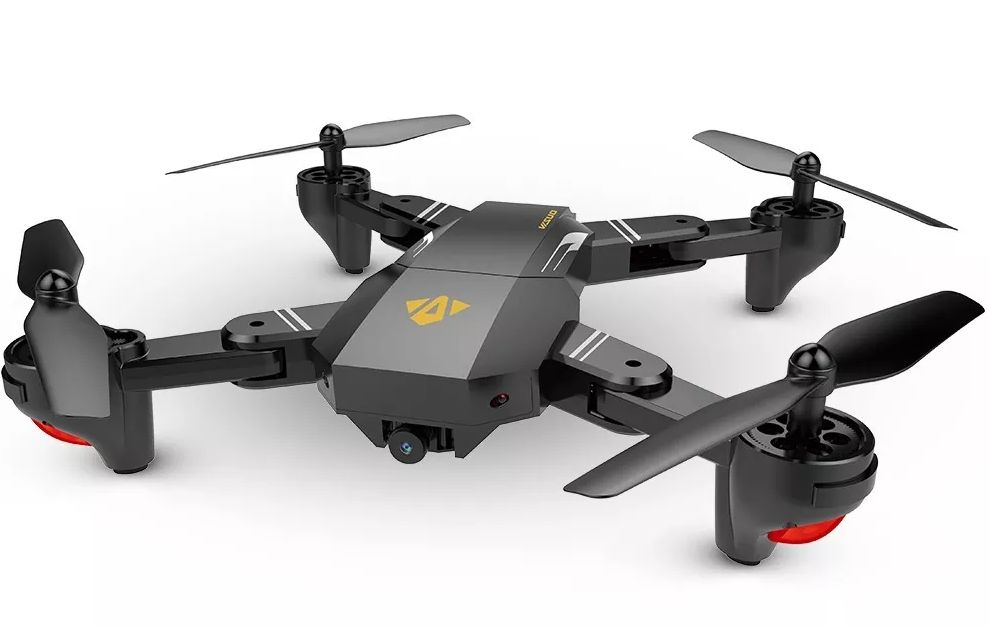

# Sobre o Rocket Star

- [Sobre o Rocket Star](#sobre-o-rocket-star)
    - [Como participar](#como-participar)
    - [Avaliação](#avalia%C3%A7%C3%A3o)
    - [Prêmio](#pr%C3%AAmio)
    - [Cronograma](#cronograma)

Uma competição entre os alunos do bootcamp da Rocketseat que tem como objetivo não só acelerar ainda mais a evolução dos devs fazendo com que apliquem o conhecimento adquirido, mas também reconhecer aqueles que mais se destacaram.

Para isso o aluno deve apresentar uma aplicação desenvolvida, com o objetivo de mostrar que domina o conteúdo do treinamento que ele participou (pode ser algo que ele desenvolveu em paralelo durante o bootcamp).

## Como participar

- Selecione uma aplicação desenvolvida com o que você aprendeu (uma API em NodeJS, um app mobile em React Native, ou um web app em ReactJS, dependendo do treinamento que você participou);
- Grave um vídeo falando da sua experiência com o bootcamp e apresentando a aplicação que você criou (lembre de se apresentar e dizer de qual treinamento você participou);
- Envie o vídeo para o email star@rocketseat.com.br com o assunto `Rocket Star - {Seu Nome}`;
- Chame a sua torcida e aguarde o resultado :rocket:

:warning: O não cumprimento de qualquer um dos itens listados acima pode desclassificar o participante.

## Avaliação

A avaliação será feita pela equipe de instrutores da Rocketseat, que vai considerar principalmente o quanto o aluno conseguiu aprender, assimilar os conceitos e aplicar os conhecimentos do bootcamp. Ou seja, o aluno precisa mostrar o quanto ele domina a ferramenta.

E como a opinião da nossa comunidade é muito importante pra gente, nada mais justo do que permitir que ela também possa se expressar nessa competição. Dessa forma, em algum momento vamos pedir ajuda para a nossa comunidade :wink:

## Prêmio

O Rocket Star precisa ser reconhecido!

A cada edição do Star nós oferecemos um prêmio diferente. Dessa vez o vencedor liva um Drone pra casa, afinal, não é só de código e café que vive um programador :heart_eyes:

## Cronograma

- 15/10: é dada a largada! Começamos a aceitar as entregas aqui;
- 26/10: prazo final para as entregas;
- 29/10: início das avaliações e opiniões da comunidade;
- 08/11: anúncio do vencedor.

Isso é tudo.

Lembrando que você pode tirar qualquer dúvida lá na [comunidade](http://comunidade.rocketseat.com.br) ou pelo e-mail [oi@rocketseat.com.br](mailto:oi@rocketseat.com.br).

Boa sorte :rocket:
