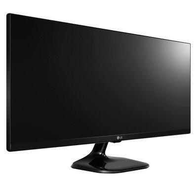

# Sobre o Rocketstar
Uma competição entre os alunos dos bootcamps da Rocketseat que tem como objetivo não só acelerar ainda mais a evolução dos devs fazendo com que apliquem o conhecimento adquirido, mas também reconhecer aqueles que mais se destacaram.

O participante deve desenvolver uma aplicação com o objetivo de mostrar que domina o conteúdo do treinamento que ele participa (caso participe de mais de um, escolha apenas um para participar).

Não existem regras ou restrições enquanto a aplicação; não precisa ser necessariamente algo desenvolvido exclusivamente para esta competição.

## Como participar
- Desenvolva uma aplicação com o que você aprendeu;
- Suba a aplicação no github;
- Adicione a tag `rocketseat` no repositório;
- O repositório deve ter um `readme.md` na raiz explicando o projeto (capriche, imagens e gifs ajudam muito);
- [Opcional] Disponibilize uma demo;
- Grave um vídeo falando da sua experiência com o treinamento e apresentando a sua aplicação (não esqueça de se aprentar e dizer qual o bootcamp que você participa);
- Envie um e-mail para star@rocketseat.com.br com o assunto `Rocketstar - {Seu Nome}`, anexe o vídeo e o link do respositório (o vídeo pode ser hospedado em outro local);
- Participe da votação e aguarde o resultado :rocket:

:warning: O não cumprimento de qualquer um dos itens listados acima desclassifica o participante automaticamente.

## Votação
A votação é aberta e ocorre por meio [deste link](https://rocketseat.com.br/rocketstar), onde será listado todos os vídeos e projetos dos participantes.

Os votos são contabilizados por meio das stars do repositório no github; sendo o repositório com mais stars o melhor colocado.

Por conta disso, é necessário que o projeto tenha sido criado a partir do dia 07/06/2018.

## Avaliação
A avaliação é feita pela equipe da Rocketseat, que vai considerar o quanto o aluno conseguiu aprender e aplicar os conhecimentos passados no bootcamp, ou seja, o quanto ele domina a ferramenta.

Os votos influênciam na avaliação, mas não necessariamente o mais votado é o vencedor.

## Prêmio
O Rocketstar precisa ser reconhecido!

Para que ele consiga ser ainda mais produtivo e codar ainda mais, o vencedor da competição leva pra casa um monitor 21" UltraWide, é só mandar o endereço :truck:

## Cronograma
- 07/06: é dada a largada! Começamos a aceitar as entregas aqui;
- 27/06: prazo final para as entregas;
- 28/06: inicio da votação;
- 03/07: término da votação;
- 04/07: anúncio do vencedor.

Isso é tudo.

Lembrando que você pode tirar qualquer dúvida lá na [comunidade](http://comunidade.rocketseat.com.br) ou pelo e-mail [oi@rocketseat.com.br](mailto:oi@rocketseat.com.br).

Boa sorte :rocket:
